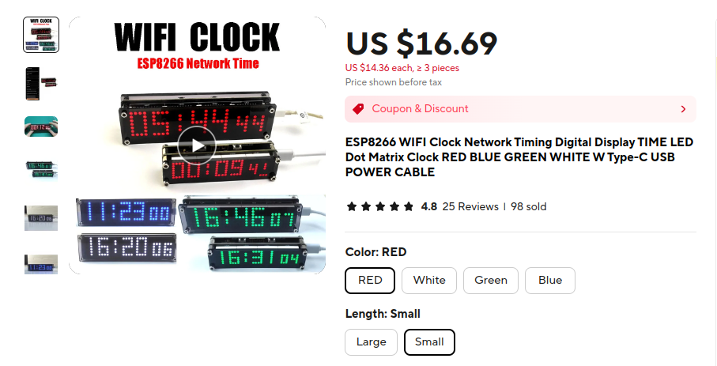

# ESP8266 WiFi Clock Network Time

This repository contains the firmware for the LED Matrix clock you can buy on Aliexpress.

The original author of the project is: https://www.youtube.com/@hacklabs. Although it is unlikely that he sells the
devices on Aliexpress.

Here is a video of the project description: https://www.youtube.com/watch?v=wF05PX6ary8

You can find the Arduino code for the ESP8266 inside the zip file ***hackclock_original_files.zip***

The device that you buy from Aliexpress comes with an updated version of the firmware. You can find the new version
inside the directory **MatrixClock_update**. The only problem is that I only found on the internet the binary so the
source code is not available.

## References
- This is a different project that uses the same device: https://github.com/trip5/EspHome-Led-PixelClock